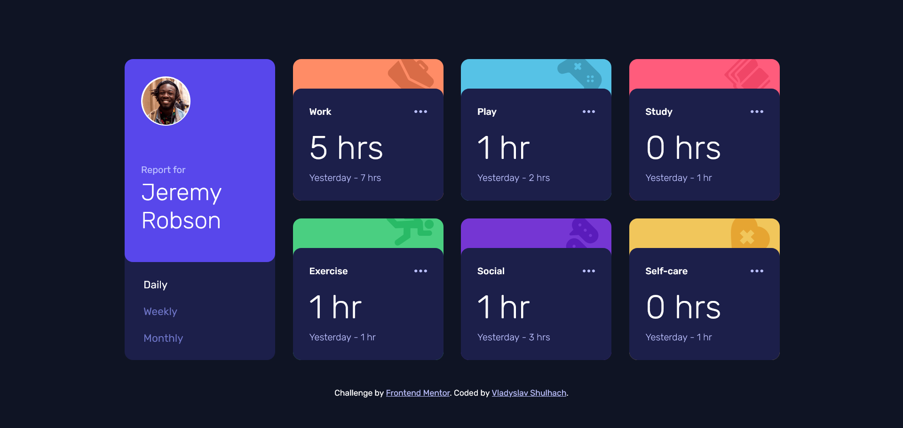

# Frontend Mentor - Time tracking dashboard solution

This is a solution to the [Time tracking dashboard challenge on Frontend Mentor](https://www.frontendmentor.io/challenges/time-tracking-dashboard-UIQ7167Jw). Frontend Mentor provides a variety of challenges to help developers practice and improve their coding skills by working on real-world projects. This challenge was a great opportunity to improve my HTML, CSS, JavaScript and responsive design abilities.

## Table of contents

- [Overview](#overview)
  - [The challenge](#the-challenge)
  - [Screenshot](#screenshot)
  - [Links](#links)
- [My process](#my-process)
  - [Built with](#built-with)
  - [What I learned](#what-i-learned)
  - [Continued development](#continued-development)
- [Author](#author)

## Overview

### The challenge

Users should be able to:

- View the optimal layout for the site depending on their device's screen size
- See hover states for all interactive elements on the page
- Switch between viewing Daily, Weekly, and Monthly stats

### Screenshot

Here is a screenshot of the project displayed on a desktop screen.



### Links

- Solution URL: [Add solution URL here](https://your-solution-url.com)
- Live Site URL: [Add live site URL here](https://your-live-site-url.com)

## My process

### Built with

- Semantic HTML5 markup
- CSS custom properties
- Flexbox
- CSS Grid
- Mobile-first workflow
- SCSS
- JavaScript

### What I learned

**1. Fetching Data with `fetch`**

I learned how to fetch and manipulate data dynamically using JavaScript. Instead of hardcoding the time tracking values directly into the HTML, I used the `fetch()` method to retrieve data from a JSON file. This approach makes the dashboard flexible and easier to maintain, as updates to the data can be handled without modifying the HTML structure.

Here’s how I fetched the data:

```js
fetch("data.json")
  .then((response) => response.json())
  .then((data) => updateDashboard(data))
  .catch(handleError);
```

The `response.json()` method converts the raw JSON data into a JavaScript object, which is then used to dynamically populate the dashboard.

**2. Updating the Dashboard Dynamically**

The `updateDashboard(data)` function dynamically updates the dashboard based on the selected timeframe (`daily`, `weekly`, or `monthly`). Each category is identified using a `data-category` attribute, which matches the activity title in the JSON data. For example:

```js
const category = document.querySelector(
  `.category[data-category='${item.title.toLowerCase().replace(/\s+/g, "-")}']`
);
```

The current and previous hours are then updated dynamically:

```js
category.querySelector(".category__time").textContent = formatHours(
  item.timeframes[timeframe].current
);

category.querySelector(".category__previous-time").textContent = `${
  previousTextMap[timeframe]
} - ${formatHours(item.timeframes[timeframe].previous)}`;
```

**3. Handling Timeframe Switching**

To allow users to switch between timeframes, I added event listeners to the timeframe buttons. When a button is clicked, the `timeframe` variable is updated, and the dashboard is refreshed:

```js
buttons.forEach((button) => {
  button.addEventListener("click", () => {
    timeframe = button.dataset.timeframe;
    buttons.forEach((btn) => btn.setAttribute("aria-selected", "false"));
    button.setAttribute("aria-selected", "true");
    updateDashboard(data);
  });
});
```

**4. Formatting Hours**

To ensure proper grammar when displaying hours, I created a utility function called `formatHours`:

```js
const formatHours = (hours) => `${hours} ${hours === 1 ? "hr" : "hrs"}`;
```

This function ensures that "hr" is used for singular values and "hrs" for plural values, improving the readability of the dashboard.

**5. Error Handling**

To handle potential issues when fetching data, I implemented a custom error handler:

```js
const handleError = (error) => {
  console.error("Error loading JSON data:", error);
};
```

This ensures that any errors during the fetch process are logged clearly in the console.

### Continued development

In future projects, I aim to focus on improving accessibility, optimizing performance for larger datasets, and exploring advanced state management techniques in JavaScript frameworks.

## Author

- Frontend Mentor - [Vladyslav Shulhach](https://www.frontendmentor.io/profile/vladyslav-shulhach)
